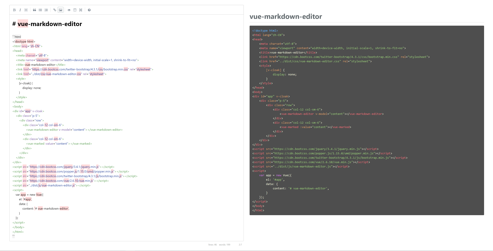

<h1 align="center">
    Vue markdown editor and marked
</h1>

<p align="center">
    <a href="https://www.npmjs.com/package/@orh/vue-markdown-editor">
        
    </a>
    <a href="https://www.npmjs.com/package/@orh/vue-markdown-editor">
        
    </a>
    <a href="https://github.com/ouronghuang/vue-markdown-editor">
        
    </a>
</p>

具备 markdown 编辑器和 marked 文本解析显示功能



## 通过链接

```html
<link href="<path>/dist/css/themes/<theme>.css" rel="stylesheet">
<link href="<path>/dist/css/vue-markdown-editor.css" rel="stylesheet">

<script src="https://cdn.bootcss.com/vue/2.6.10/vue.min.js"></script>
<script src="<path>/dist/js/vue-markdown-editor.js"></script>
```

[示例](./examples/index.html)

## NPM

1. 安装

```shell
$ yarn add @orh/vue-markdown-editor --dev
```

2. 常规

- `main.js`

```javascript
import Vue from 'vue';
import VueMarkdownEditor from '@orh/vue-markdown-editor';
import '@orh/vue-markdown-editor/dist/css/themes/<theme>.css';
import '@orh/vue-markdown-editor/dist/css/vue-markdown-editor.css';
import App from './App.vue';

Vue.use(VueMarkdownEditor);

new Vue({
  el: '#app',
  render: h => h(App)
});
```

3. Laravel

- `resources/js/app.js`

```javascript
import VueMarkdownEditor from '@orh/vue-markdown-editor';

Vue.use(VueMarkdownEditor);
```

- `resources/sass/app.scss`

```scss
@import "~@orh/vue-markdown-editor/dist/css/themes/<theme>.css";
@import "~@orh/vue-markdown-editor/dist/css/vue-markdown-editor.css";
```

## 使用编辑器

```html
<vue-markdown-editor v-model="content"></vue-markdown-editor>
```

- [simplemde-markdown-editor](https://github.com/sparksuite/simplemde-markdown-editor)
- Props

| 属性 | 说明 | 类型 | 默认值 |
| --- | --- | --- | --- |
| value | markdown 文本，可以使用 v-model 双向绑定数据 | String | 空 |
| options | 可传入 simplemde-markdown-editor 的所有配置 | Object | {} |
| name | 表单 textarea 的 name 属性 | String | - |

## 使用解析器

```html
<vue-marked :value="content"></vue-marked>
```

- [marked](https://github.com/markedjs/marked)
- [highlight.js](https://github.com/highlightjs/highlight.js)
- Props

| 属性 | 说明 | 类型 | 默认值 |
| --- | --- | --- | --- |
| value | markdown 文本 | String | 空 |

## 代码高亮主题

- 使用 [marked](https://github.com/markedjs/marked) 时的代码高亮样式
- 包含 [highlight.js](https://github.com/highlightjs/highlight.js) 的所有主题
- [可用主题列表](./dist/css/themes)

## License

MIT
